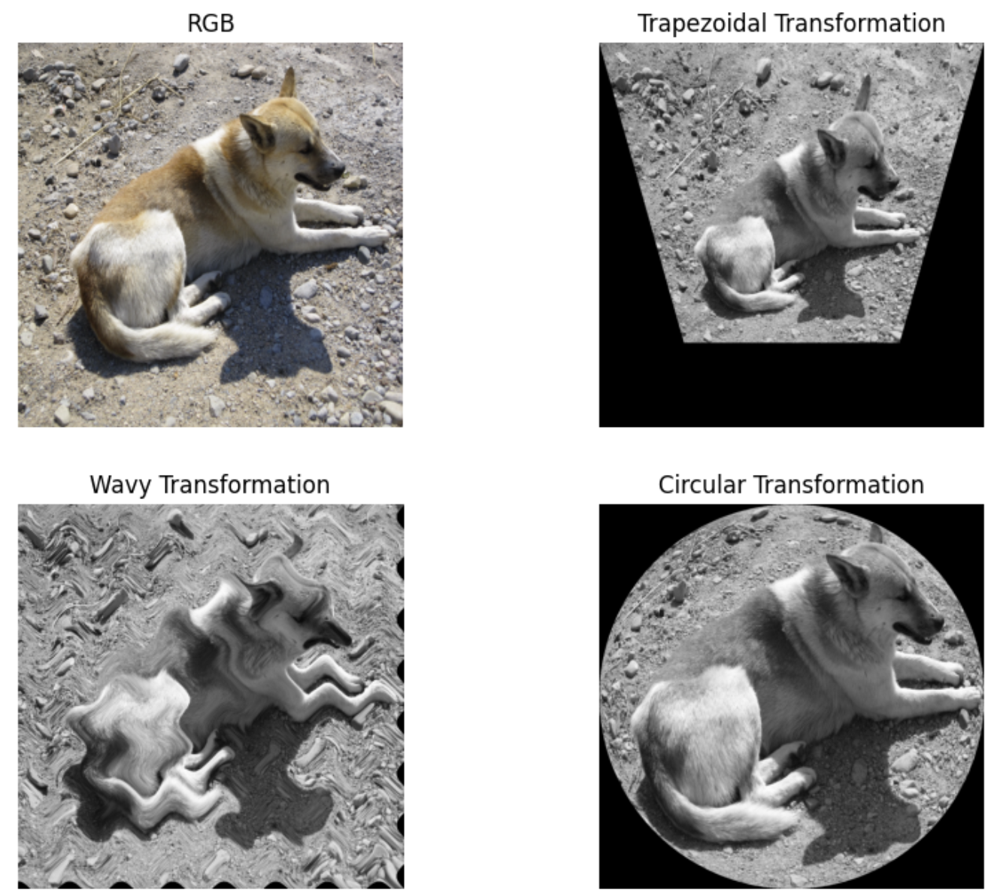
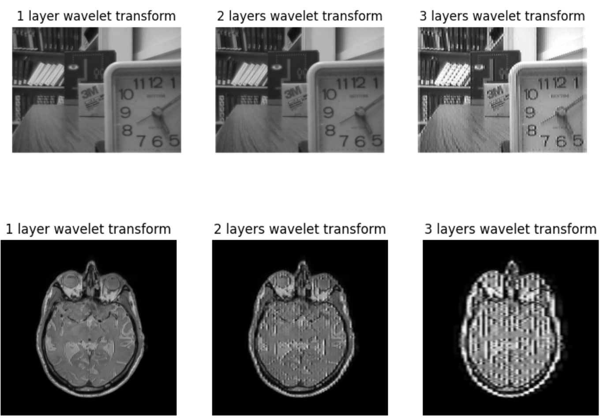

# PyQt5-Image-Processing-GUI

A user-friendly image processing application built with **PyQt5**. This graphical interface supports essential image editing functions including geometric transformations, wavelet fusion, and image enhancements.

## 🚀 Features

- 📂 **Image Loading & Display**  
  Load and view images in the GUI using QFileDialog and QLabel.

- 🔄 **Geometric Transformations**  
  Rotate, flip, and translate selected image areas.
  

- 🌊 **Wavelet Fusion**  
  Merge two images using Haar wavelet-based image fusion techniques.
  

- 🎨 **Regional_Segmentation**  
  Segment specific regions of the image for focused processing and analysis.
  

- 💾 **Save Processed Images**  
  Export the edited image with a single click.

---

## 🛠️ Requirements

- Python 3.8+
- PyQt5
- OpenCV (`cv2`)
- NumPy
- PyWavelets (`pywt`)

Install all dependencies:
```bash
pip install -r requirements.txt
```

---

## 📁 Project Structure

```
PyQt5-Image-Processing-GUI/
├── main.py                  # Main PyQt5 GUI script
├── image_utils.py           # Utility functions for image operations
├── wavelet_fusion.py        # Wavelet image fusion logic
├── assets/                  # (Optional) Default images or icons
├── README.md                # This file
└── requirements.txt         # Required packages
```

---

## 🔧 To Run

```bash
python main.py
```
